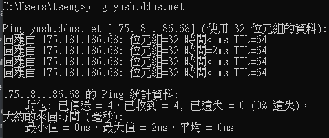
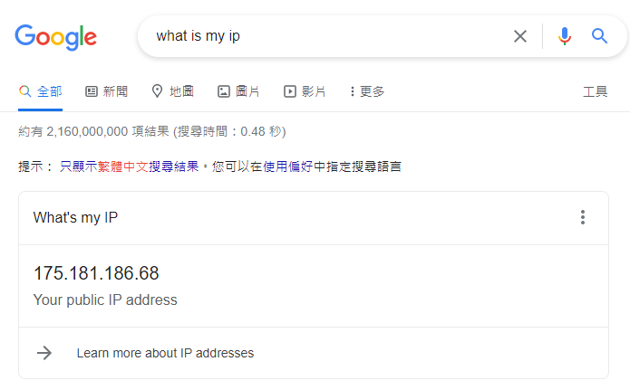

## Router NOIP

- Setup Router DDNS

  - Go `http://mwlogin.net/`
  - Setup Dynamic DNS
    
  - Setup NO-IP Service Provider
      
  - check IP by command `ping {dns}`, replace `{dns}` to NO-IP hostname and check ip is the same as yours.
    
    

