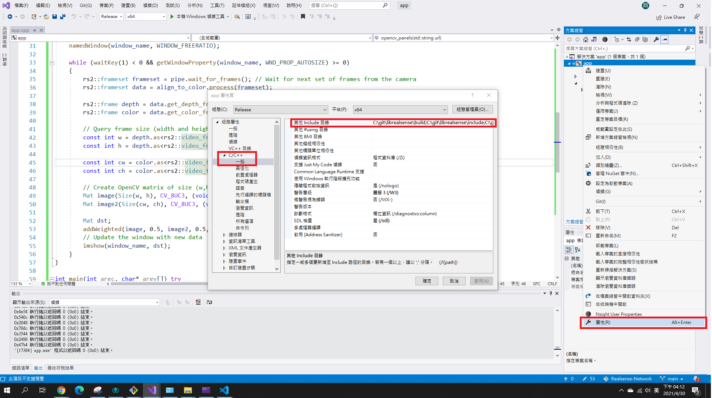
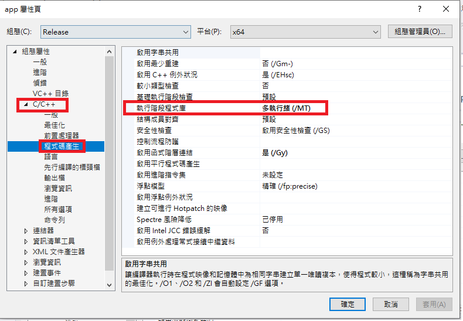
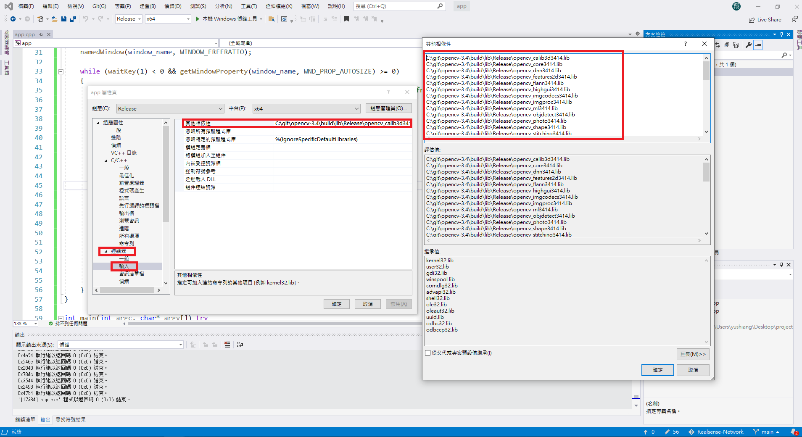

# win10 vs2019 OpenCV + Realsesne

- assume librealsense and opencv already build at `C:\git\librealsense\build` and `C:\git\opencv-3.4\build`

- platform `Release/x64`

- set `C/C++\general\include`( copy from rs-imshow example )

```
C:\git\librealsense\build;C:\git\librealsense\include;C:\git\opencv-3.4\build;C:\git\opencv-3.4\include;C:\git\opencv-3.4\include\opencv;C:\git\opencv-3.4\modules\core\include;C:\git\opencv-3.4\modules\flann\include;C:\git\opencv-3.4\modules\imgproc\include;C:\git\opencv-3.4\modules\ml\include;C:\git\opencv-3.4\modules\photo\include;C:\git\opencv-3.4\modules\video\include;C:\git\opencv-3.4\modules\dnn\include;C:\git\opencv-3.4\modules\features2d\include;C:\git\opencv-3.4\modules\imgcodecs\include;C:\git\opencv-3.4\modules\shape\include;C:\git\opencv-3.4\modules\videoio\include;C:\git\opencv-3.4\modules\calib3d\include;C:\git\opencv-3.4\modules\highgui\include;C:\git\opencv-3.4\modules\objdetect\include;C:\git\opencv-3.4\modules\stitching\include;C:\git\opencv-3.4\modules\superres\include;C:\git\opencv-3.4\modules\ts\include;C:\git\opencv-3.4\modules\videostab\include;%(AdditionalIncludeDirectories)
```


- set `C/C++\code gen` to `多執行緒 (/MT)`



- set `link\input\` ( copy from rs-imshow example and modify some relative path )
```
C:\git\opencv-3.4\build\lib\Release\opencv_calib3d3414.lib
C:\git\opencv-3.4\build\lib\Release\opencv_core3414.lib
C:\git\opencv-3.4\build\lib\Release\opencv_dnn3414.lib
C:\git\opencv-3.4\build\lib\Release\opencv_features2d3414.lib
C:\git\opencv-3.4\build\lib\Release\opencv_flann3414.lib
C:\git\opencv-3.4\build\lib\Release\opencv_highgui3414.lib
C:\git\opencv-3.4\build\lib\Release\opencv_imgcodecs3414.lib
C:\git\opencv-3.4\build\lib\Release\opencv_imgproc3414.lib
C:\git\opencv-3.4\build\lib\Release\opencv_ml3414.lib
C:\git\opencv-3.4\build\lib\Release\opencv_objdetect3414.lib
C:\git\opencv-3.4\build\lib\Release\opencv_photo3414.lib
C:\git\opencv-3.4\build\lib\Release\opencv_shape3414.lib
C:\git\opencv-3.4\build\lib\Release\opencv_stitching3414.lib
C:\git\opencv-3.4\build\lib\Release\opencv_superres3414.lib
C:\git\opencv-3.4\build\lib\Release\opencv_video3414.lib
C:\git\opencv-3.4\build\lib\Release\opencv_videoio3414.lib
C:\git\opencv-3.4\build\lib\Release\opencv_videostab3414.lib
C:\git\librealsense\build\src\ethernet\Release\realsense2-net.lib
C:\git\opencv-3.4\build\3rdparty\lib\Release\libprotobuf.lib
comctl32.lib
gdi32.lib
ole32.lib
setupapi.lib
ws2_32.lib
C:\git\opencv-3.4\build\3rdparty\lib\Release\quirc.lib
C:\git\opencv-3.4\build\3rdparty\lib\Release\libwebp.lib
C:\git\opencv-3.4\build\3rdparty\lib\Release\libpng.lib
C:\git\opencv-3.4\build\3rdparty\lib\Release\libtiff.lib
C:\git\opencv-3.4\build\3rdparty\lib\Release\libjasper.lib
C:\git\opencv-3.4\build\3rdparty\lib\Release\IlmImf.lib
C:\git\opencv-3.4\build\3rdparty\lib\Release\zlib.lib
C:\git\opencv-3.4\build\3rdparty\lib\Release\ittnotify.lib
C:\git\opencv-3.4\build\3rdparty\lib\Release\ippiw.lib
C:\git\opencv-3.4\build\3rdparty\ippicv\ippicv_win\icv\lib\intel64\ippicvmt.lib
C:\git\librealsense\build\Release\realsense2.lib
kernel32.lib
user32.lib
winspool.lib
shell32.lib
oleaut32.lib
uuid.lib
comdlg32.lib
advapi32.lib
```


- copy `realsense.dll` and `realsense-net.dll` from `C:\git\librealsense\build\Release` to your project `x64` folder.