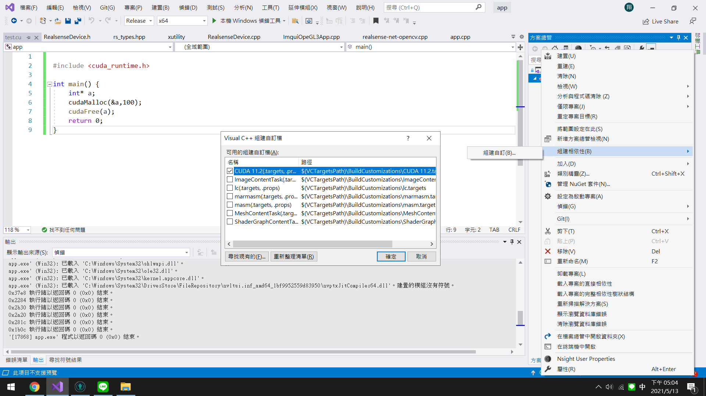
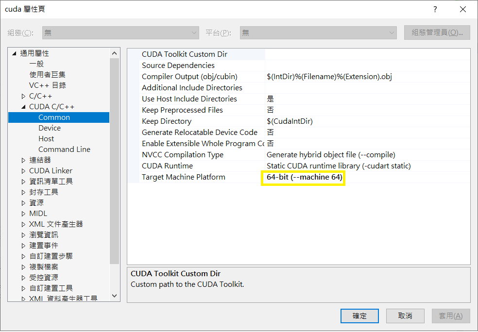
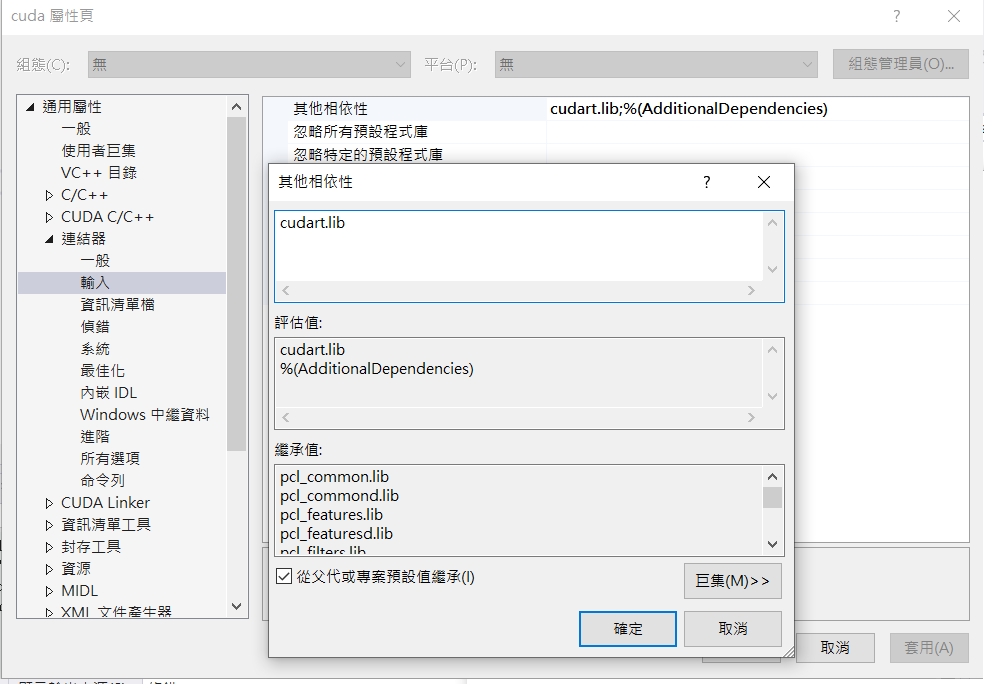

# win10 vs2019 Cuda

- install [cuda](https://developer.nvidia.com/cuda-toolkit-archive)( with Visual studio integration )

- add cuda to project

- set platform ( 檢視(V)/其他視窗(E)/屬性管理員(N)/Release|x64/cuda )

- add libirary

