# Ubuntu realsense server + windows client)

## Devices Requirements

- N Ubuntu PCs (run rs-server) + N realsenses
- 1 router (use LAN with DHCP)
- 1 Windows PC (run app)

# Linux realsense server

- [install realsense SDK](https://github.com/IntelRealSense/librealsense/blob/master/doc/distribution_linux.md) ( [local version](./doc/distribution_linux.md) )

- Auto login

    1. Detail/user/
    2. unlock button, type password
    3. toggle auto login ON

- [Set screen blanking time](https://help.ubuntu.com/stable/ubuntu-help/display-blank.html.en)
    1. Open the Activities overview and start typing Power.

    2. Click `Power` to open the panel.

    3. Use the Blank screen drop-down list under Power Saving to set the time until the screen blanks, or disable the blanking completely.
- [The screen locks itself too quickly
](https://help.ubuntu.com/stable/ubuntu-help/session-screenlocks.html.en)

    1. Open the Activities overview and start typing Privacy.

    2. Click on `Privacy` to open the panel.

    3. Press on `Screen Lock`.

    4. If Automatic Screen Lock is on, you can change the value in the Lock screen after blank for drop-down list.

- run command `rs-server`

# Windows Client

- requirements

    - vs2019 + Window SDK
    - [cmake 3.18.3](https://github.com/Kitware/CMake/releases?after=v3.19.0-rc2)

## OpenCV

- build realsenseSDK with opencv, network-device

- [build with opencv](https://github.com/IntelRealSense/librealsense/blob/master/wrappers/opencv/readme.md)( [local version](./doc/realsense-opencv.md) ), Uncheck `BUILD_SHARED_LIBS`, check `old-jpeg` 
    - if you need `NETWORK_DEVICE` in realsense, because realsense cmake have `libjpeg-turbo` too.
    
        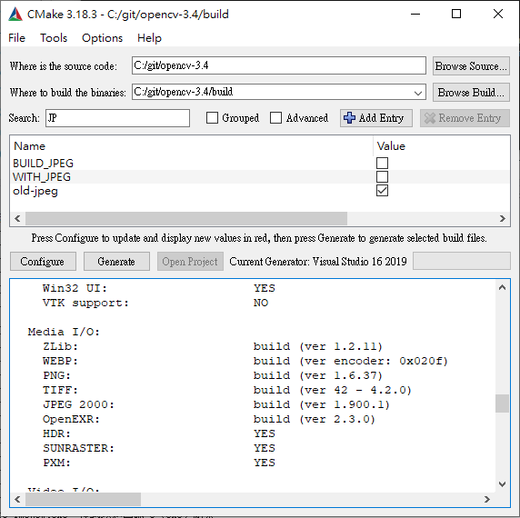

    - disable `BUILD_WITH_STATIC_CRT`

        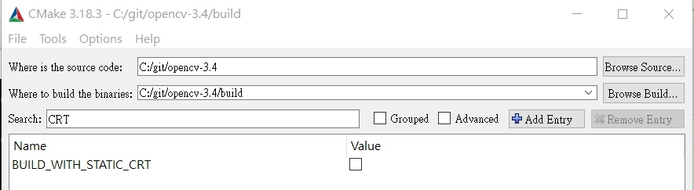


    - aruco is needed build with [opencv_contrib](https://github.com/opencv/opencv_contrib/tree/3.4) and include `.hpp`

        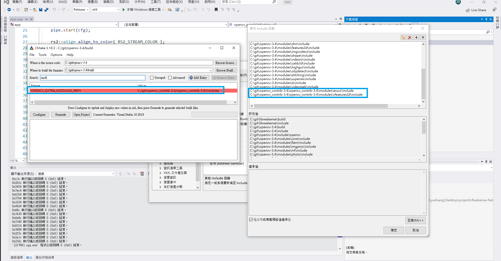
        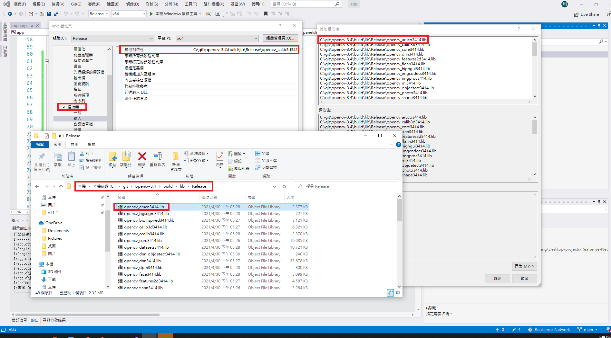

## Realsense

- build with network-device  :

```
# Building from Source
git clone https://github.com/IntelRealSense/librealsense.git

cd librealsense/
mkdir build
cd build

cmake-gui  ..
```

- Press Configure and Make sure you check the `BUILD_CV_EXAMPLES` and `BUILD_NETWORK_DEVICE` flag but disable `BUILD_WITH_STATIC_CRT`, then click Configure again

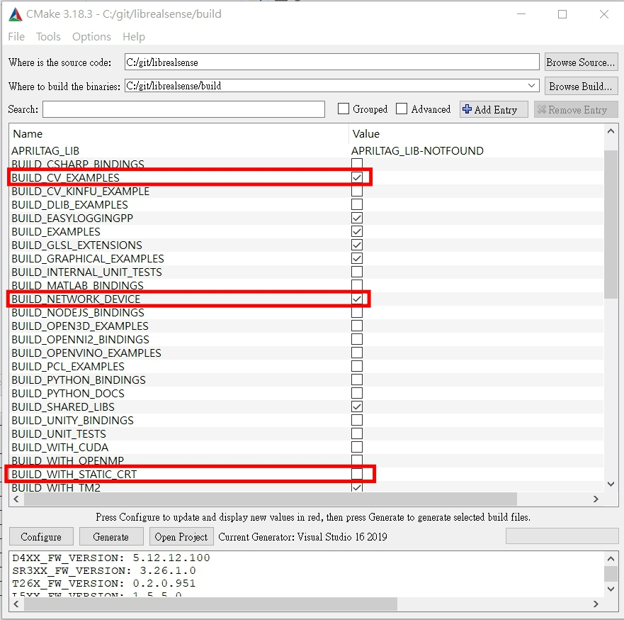

- Specify CMake binaries folder for OpenCV as `OpenCV_DIR` (c:/git/opencv-3.4/build)

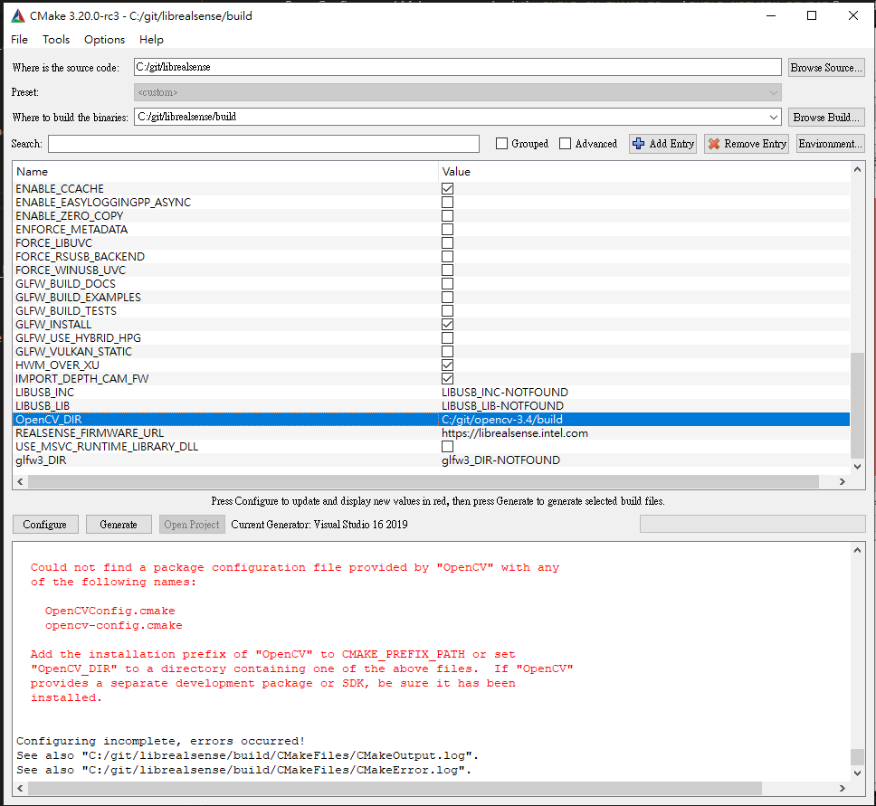

- set opencv dll to realsense directory

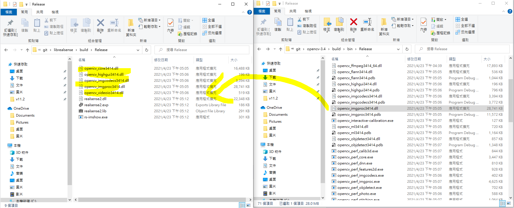

## Run viewer

- get device ip address by `ifconfig` or `hostname -I` in ubuntu.
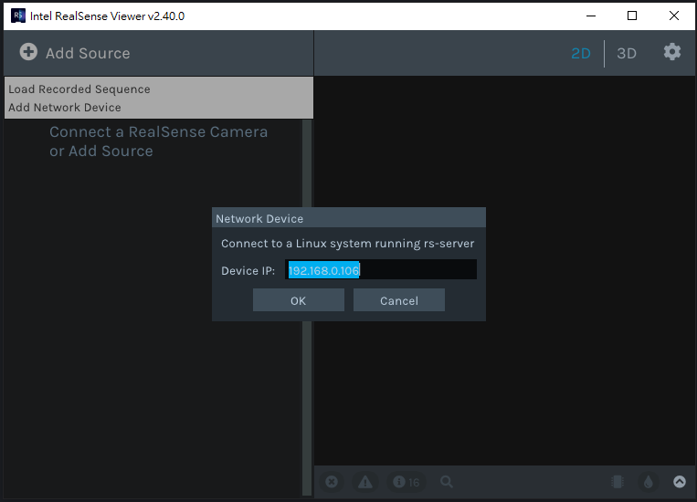
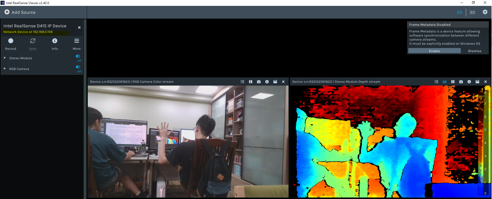

## Run Example (network in necessary for checking packages)

- finde examples at `C:\git\librealsense\build\examples\RealsenseExamples.sln`

- add `realsense2-net` to `CMakeLists.txt`-`target_link_libraries`
    
    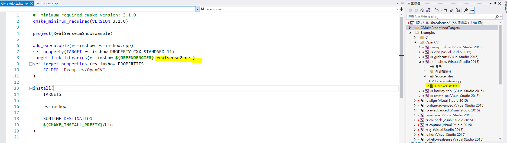

- Use our `./rs-imshow.cpp` code to test network device or build one your self :

    - include `<librealsense2-net/rs_net.hpp>`

    - build network pipe
        ```
        rs2::net_device dev("192.168.0.106");
        rs2::context ctx;
        dev.add_to(ctx);
        rs2::pipeline pipe(ctx);

        rs2::config cfg;
        cfg.enable_stream(RS2_STREAM_DEPTH,640,480,RS2_FORMAT_Z16,30);
        cfg.enable_stream(RS2_STREAM_COLOR,1280,720, RS2_FORMAT_BGR8, 30);
        ```
        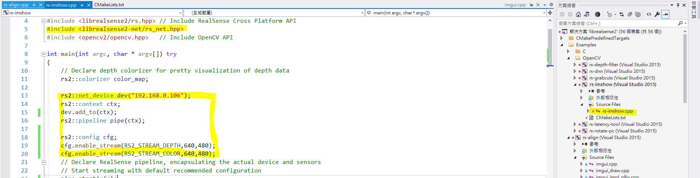

    - run and click `reload project`.