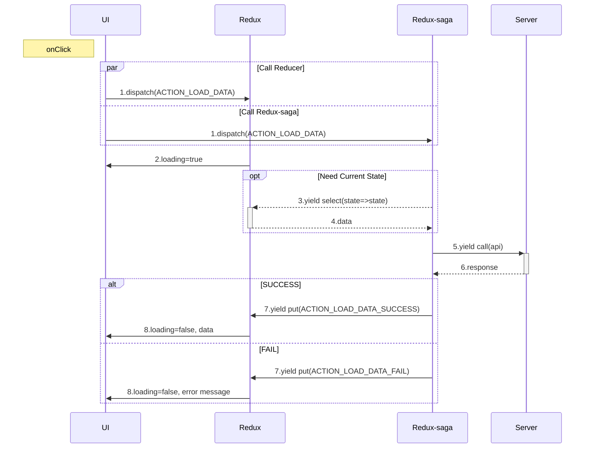

# redux-saga

## Setup

- install packages

    ```
    yarn add react-redux redux-saga immer
    ```
    - redux : global state
    - reduex-saga :  middleware is used for async request
    - immer : work with immutable state in a more convenient way


- 8 files you need to setup for this tutorial

    ```
    .
    └── config
    |   └── configureStore.js
    └── constants
    |   └── todo.js
    └── pages
    |   └── _app.js
    └── redux
        ├── actions
        |   └── todo.js
        └── reducers
        |   └── index.js
        |   └── todo.js
        └── sagas
            └── index.js
            └── todo.js
    ```

- constant

    `./constants/todo.js`
    
    ```javascript
    // dispatch to saga from hook
    export const LIST_ACTION_ADD = "LIST_ACTION_ADD"; 

    // dispatch to redux from saga 'put' effect
    export const LIST_ACTION_ADD_SUCCESS = "LIST_ACTION_ADD_SUCCESS";
    ```

- redux-saga

    `./redux/sagas/todo.js` : watch saga dispacth.
    
    ```javascript
    import { takeEvery, put, select } from "redux-saga/effects";
    import { LIST_ACTION_ADD, LIST_ACTION_ADD_SUCCESS } from "../../constants/todo";

    let counter = 0;

    function* add({ text }) {
        const { todos } = yield select(state => state.todo)
        yield put({
            type: LIST_ACTION_ADD_SUCCESS,
            payload: [...todos, {
                text,
                id: counter++
            }]
        })
    }

    export default [
        takeEvery(LIST_ACTION_ADD, add)
    ]
    ```

    `./redux/sagas/index.js` : export all sagas to watch at the same time.
    
    ```javascript
    import { all } from "redux-saga/effects"
    import todo from "./todo"

    export default function* rootSaga() {
        yield all([...todo])
    }
    ```

- reducer

    `./redux/reducers/todos.js` : watch saga's 'put' effect to call reducer with preprocessed data
    
    ```javascript
    import produce from "immer";
    import { LIST_ACTION_ADD_SUCCESS } from "../../constants/todo";
    const initialState = {
        todos: []
    }

    const todo = (state = initialState, action) => produce(state, draft => {
        switch (action.type) {
            case LIST_ACTION_ADD_SUCCESS:
                draft.todos = action.payload;
                break
            default:
                break
        }
    })


    export default todo;
    ```

    `./redux/reducers/index.js` : watch all actions includes sagas' put effect and original redux dispatch
    
    ```javascript
    import { combineReducers } from "redux";
    import todo from "./todo"

    const rootReducer = combineReducers({
        todo
    })

    export default rootReducer;
    ```

- action

    `./redux/actions/todos.js` :  funtion use to dispatch saga or redux depends on  `type`
    
    ```javascript
    import { LIST_ACTION_ADD } from "../../constants/todo";

    export const add = (text) => {
        return {
            type: LIST_ACTION_ADD,
            text
        }
    }
    ```

- store with saga

    `./config/configureStore.js`

    ```javascript
    import { createStore, applyMiddleware } from "redux";
    import createSagaMiddleware from "redux-saga";

    import rootReducer from "../redux/reducers";
    import rootSaga from "../redux/sagas";

    const sagaMiddleware = createSagaMiddleware();

    export default createStore(rootReducer, applyMiddleware(sagaMiddleware));

    sagaMiddleware.run(rootSaga);
    ```

- use store in app

    `./pages/_app.js` : use provider with store

    ```javascript
    import '../styles/globals.css'
    import type { AppProps } from 'next/app'
    import { Provider } from "react-redux";
    import store from "../config/configureStore";

    function MyApp({ Component, pageProps }: AppProps) {
    return <Provider store={store}>
        <Component {...pageProps} />
    </Provider>
    }

    export default MyApp

    ```

- component for testing

    ```javascript
    import { useState } from "react"
    import { useSelector, useDispatch } from "react-redux"
    import { add } from "../../redux/actions/todo"

    const TextInput = () => {
        const [text, setText] = useState("")
        const todo = useSelector(state => state.todo)
        const dispatch = useDispatch()

        const onChange = (e) => {
            setText(e.target.value)
        }

        const onClick = () => {
            dispatch(add(text))
            setText("")
        }

        return <>
            <pre>{JSON.stringify(todo, null, 4)}</pre>
            <input type="text" value={text} onChange={onChange} />
            <button onClick={onClick}>add</button>
        </>
    }

    export default TextInput
    ```

## Flow chart of Load data


