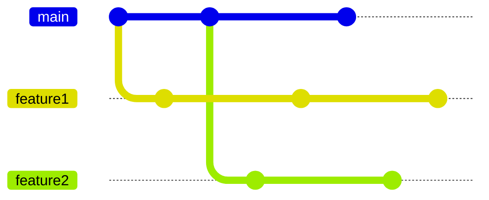

# Resovle Conflict

## Scenario

- `feature1` is ready to merge to `master`, but have conflicts.



## Resolve By Merge 


## Resolve By Rebase

- Go `feature1` and rebase to `main`

```
git checkout feature1
git rebase main
```

- Then, resolve conflicts for each commit. 
- After resovle conflicts run `git rebase --continue` to go next commit.
-
