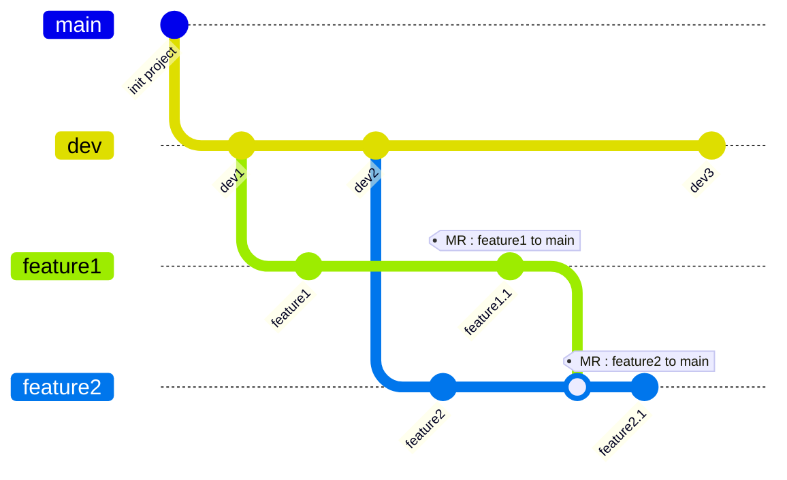
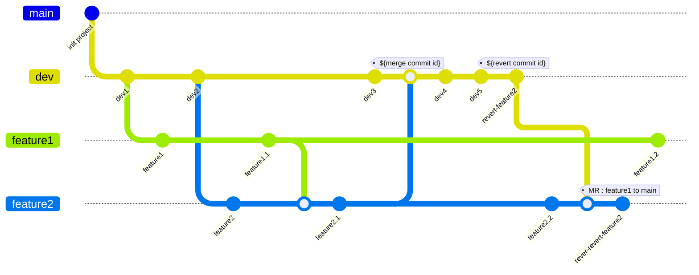

# Revert Merge Request

## Scenario

- `feature2`'s MR and `feature1`'s MR are waiting code review



## Merge without code review accidentally

- what happened:
  - `feature2`'s author accidentally click the merge button on MR
  - Then, gitlab automatically merge `feature2` and `feature1` into `dev`, and both MR is mark as merged.



### Revert merge

```
git checkout dev
git branch revert-feature2
git checkout revert-feature2
git revert ${merge commit id} -m 1
:q
git checkout dev
git merge revert-feature2
git push
```

### Reopen Feature2 MR

```
git checkout feature2
git push
git merge dev
git revert ${revert commit id} -m 1
:q
git push

```

## Reproduce scenario with gitlab

- init repo

  ```
  git clone ${repo/on/gitlab}
  git branch dev
  git checkout dev
  touch dev1
  git add .
  git commit -m "dev1"
  git branch feature1
  git checkout feature1
  touch feature1
  git add .
  git commit -m "feature1"
  git checkout dev
  touch dev2
  git add .
  git commit -m "dev2"
  git branch feature2
  git checkout feature2
  touch feature2
  git add .
  git commit -m "feature2"
  git checkout feature1
  touch feature1.1
  git add .
  git commit -m "feature1.1" 
  git checkout feature2
  git merge feature1
  touch feature2.1
  git add .
  git commit -m "feature2.1" 
  git checkout dev
  touch dev3
  git add .
  git commit -m "dev3" 
  git push --set-upstream origin dev
  git checkout feature1
  git push --set-upstream origin feature1
  git checkout feature2
  git push --set-upstream origin feature2

  ```

- create MR on gitlab : `feature1 to dev`, `feature2 to dev`
- merge MR `feature2 to dev`
- `git remote update --prune` and you will see git graph the same as `Merge without code review accidentally` section.
