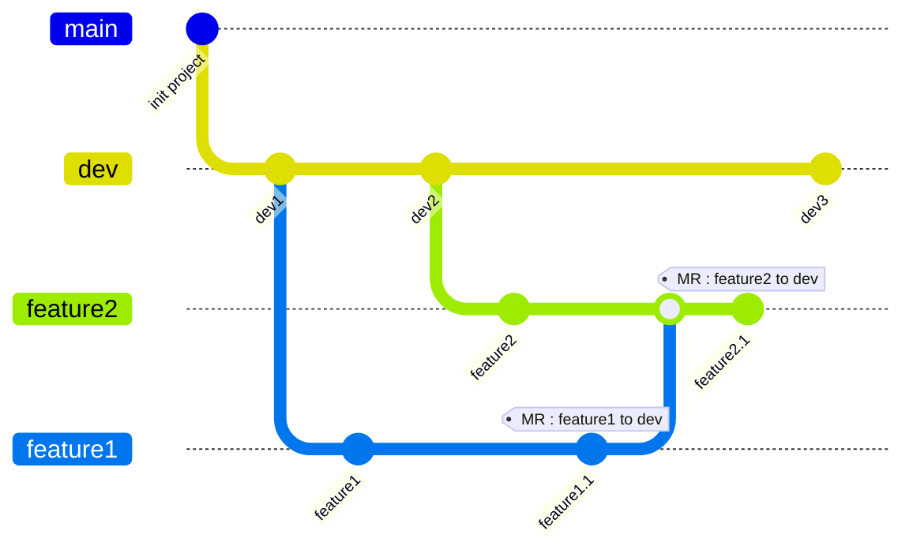
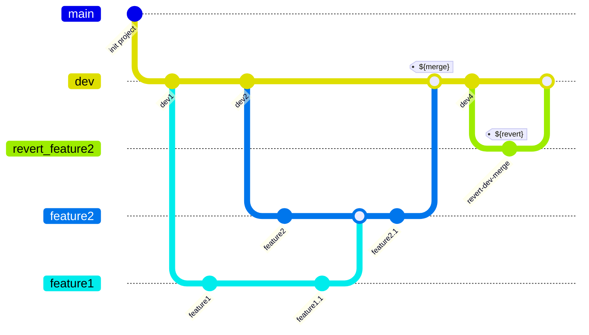
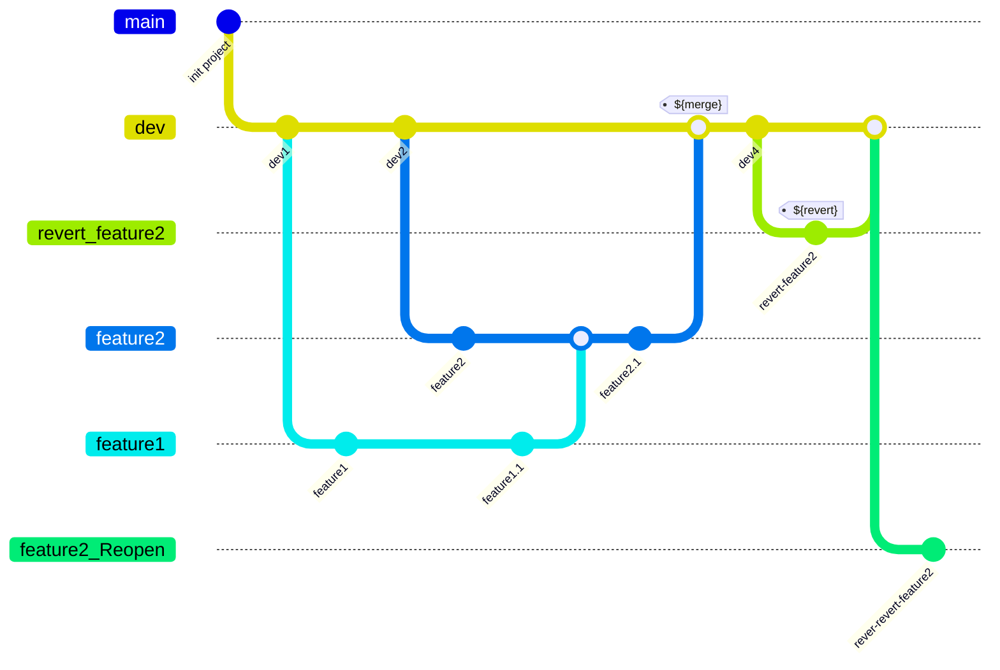
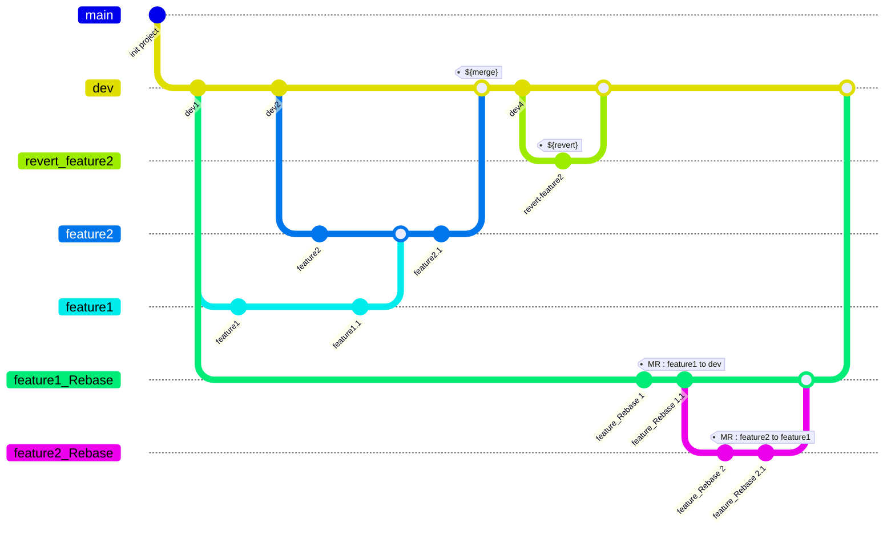

# Revert Merge Request

## Scenario

- `feature2`'s MR and `feature1`'s MR are waiting code review



## Merge without code review accidentally

- what happened:
  - `feature2`'s author accidentally click the merge button on gitlab merge request ui.
  - Then, gitlab automatically merge `feature2` and `feature1` into `dev`, and both MR is mark as merged.
  - `feature1` and `feature2` can no longer merge to `dev`, becase they already exist in history.



- first thing to do is `revert` the merge commit.
```
git checkout dev
git checkout -b revert_feature2
git revert ${merge commit id} -m 1
:q
git checkout dev
git merge revert-feature2
git push
```


## Merge Features Again

- Needs to open a new merge request for recovered branches, old MR has already marked as merged.

### Using Revert(not recommended)
```
git checkout dev
git checkout -b feature2_Reopen
git revert ${revert commit id} -m 1
:q
git push
```

### Problem

- commit messages of features missing in new MR
- Can't recover `feature1` with `git revert`.
- Some code of `feature1` stuck in `feature2`, such as commits `feature1`,`feature1.1` in above case.

### Discussion

- During develop
  - Don't merge any feature branch to other branches, only merge it's base branch to sync updates.
  - Uses `rebase` to move whole branch to the other branch for some functions.

- Recover feature1 changes
  - we can split revert changes to `feature1` and `feature2` part with additional branch doing the same merges happened in `feature2`, such as merge `feature1`, then merge `feature2` we can revert and revert each merges to get changes of `feature1` and `feature2`.

### Using Rebase + Force Push
```
git checkout feature1
git rebase ${dev1 commit id(latest commit merge into feature1)} --ignore-date
git push -f
git checkout feature2
git rebase feature1 --ignore-date
git push -f
```


## Reproduce scenario with gitlab

- init repo

  ```
  git clone ${repo/on/gitlab}
  git checkout -b dev
  touch dev1
  git add .
  git commit -m "dev1"
  git checkout -b feature1
  touch feature1
  git add .
  git commit -m "feature1"
  git checkout dev
  touch dev2
  git add .
  git commit -m "dev2"
  git checkout -b feature2
  touch feature2
  git add .
  git commit -m "feature2"
  git checkout feature1
  touch feature1.1
  git add .
  git commit -m "feature1.1" 
  git checkout feature2
  git merge feature1
  touch feature2.1
  echo "change feature1.1" > feature1.1
  git add .
  git commit -m "feature2.1" 
  git checkout dev
  touch dev3
  git add .
  git commit -m "dev3" 
  git push --set-upstream origin dev
  git checkout feature1
  git push --set-upstream origin feature1
  git checkout feature2
  git push --set-upstream origin feature2

  ```

- create MR on gitlab : `feature1 to dev`, `feature2 to dev`
- merge MR `feature2 to dev`
- `git remote update --prune` and you will see git graph the same as `Merge without code review accidentally` section.
