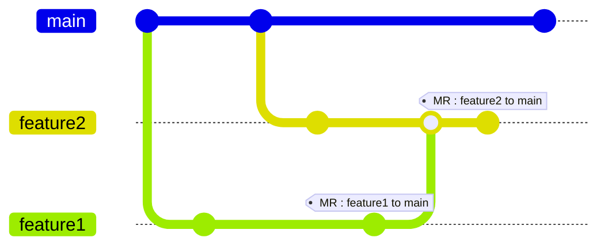
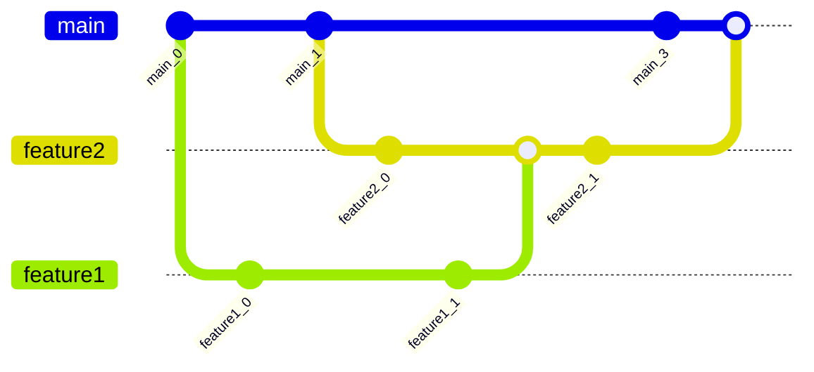
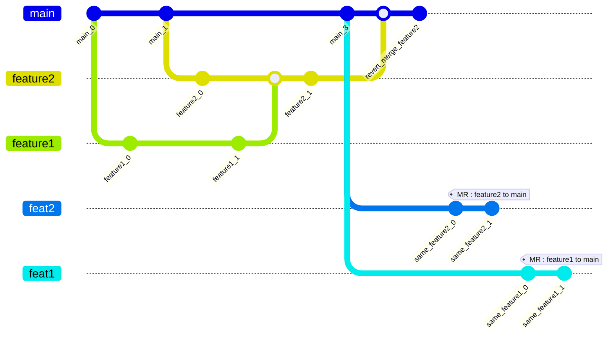

# Revert Merge Request

## Scenario

- `feature2`'s MR and `feature1`'s MR are waiting code review

## Merge without code review accidentally

- what happened:
  - `feature2`'s author accidentally click the merge button on MR.
  -  merge `feature2` and `feature1` into `main`, and both MR is mark as merged.

### Revert merge

- `git revert ${accidentally merge commit id} -m 1`

### Reopen both MR

- `git checkout main`
- `git reset ${main_3 commit id}`
- `git checkout feature2`
- `git rebase main`
- `git push -f`
- `git checkout feature1`
- `git rebase main`
- `git push -f`

