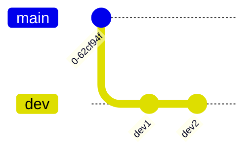
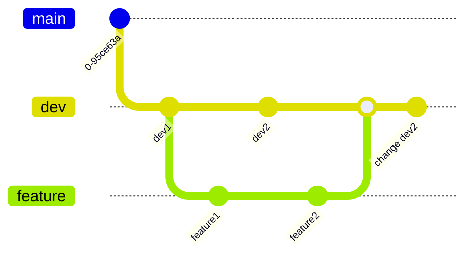

# Undo force push

- [reference](https://www.jvt.me/posts/2021/10/23/undo-force-push/)
- [view git graph on github](https://github.com/tsengyushiang/notes/blob/master/git/undo-force-push.md)


## Reproduce scenario

- init repo

```
git clone ${repo/on/gitlab}
git checkout -b dev
touch dev1
git add .
git commit -m "dev1"
git checkout -b feature
touch feature1
git add .
git commit -m "feature1"
git checkout dev
touch dev2
git add .
git commit -m "dev2"
git checkout feature
touch feature2
git add .
git commit -m "feature2"
git checkout dev
git merge feature
git branch --delete feature
echo "change dev2" > dev2
git add .
git commit -m "change dev2"
git push --set-upstream origin dev
```

- initial git graph


- reset to previous version and force push

```
git checkout dev
git reset ${dev2 commit id} --hard
git push --force
```

- now, git graph become this


## Undo force push

### Log history

```
$ git reflog refs/remotes/origin/dev
da6cd62 (HEAD -> dev, origin/dev) refs/remotes/origin/dev@{0}: update by push
d3bee70 refs/remotes/origin/dev@{1}: update by push
```

### Reset to previous state

```
git branch backup/dev
git reset --hard ${previous commit id (d3bee70 in above example)}
git push --force
```

- Then we can get our code back

