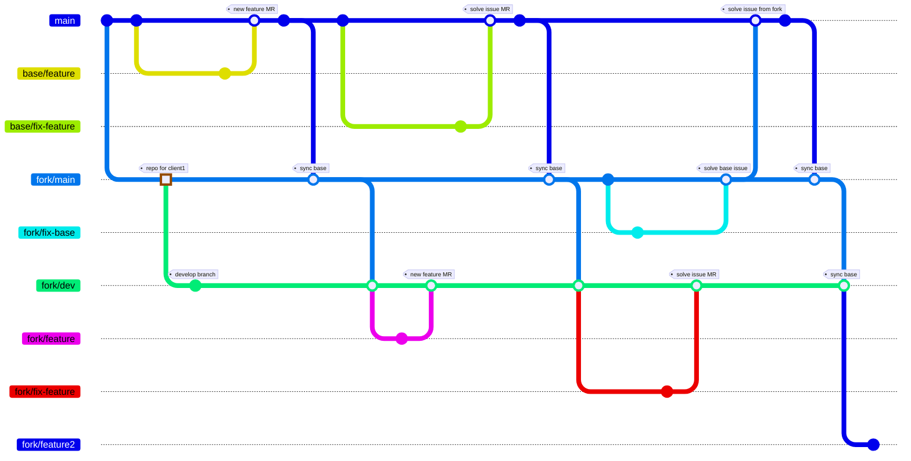
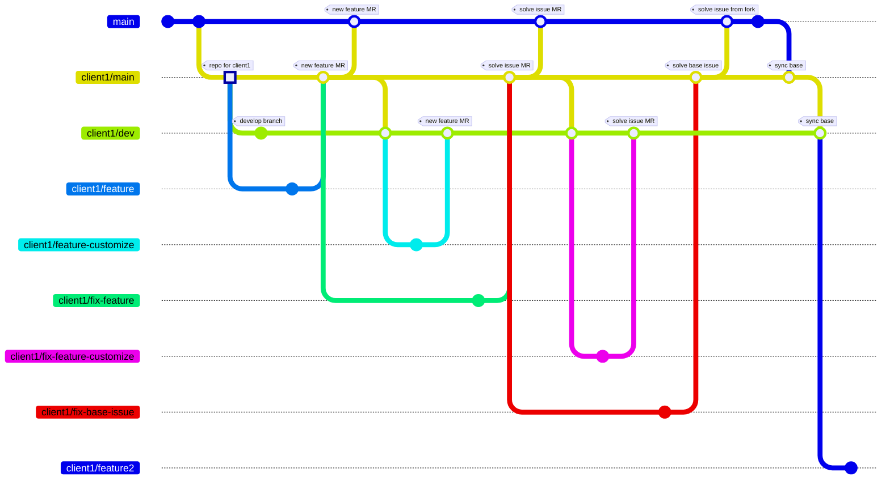

# Fork Workflow

- [view on github](https://github.com/tsengyushiang/notes/blob/master/git/workflow.md)

## Develop feature on base repo

``` mermaid
%%{init: { 'gitGraph': {'showCommitLabel': false}} }%%

gitGraph
    commit
    branch fork/main order: 5
    checkout main
    commit
    branch base/feature order: 1
    checkout fork/main
    commit tag:"repo for client1" type: HIGHLIGHT
    branch fork/dev order: 7
    commit tag:"develop branch"
    checkout base/feature
    commit
    checkout main
    merge base/feature tag:"new feature MR"
    commit
    checkout fork/main
    merge main tag:"sync base"
    checkout main
    commit
    branch base/fix-feature order: 2
    checkout fork/dev
    merge fork/main
    branch fork/feature order: 8
    commit
    checkout fork/dev
    merge fork/feature tag:"new feature MR"
    checkout base/fix-feature
    commit
    checkout main
    merge base/fix-feature tag:"solve issue MR"
    commit
    checkout fork/main
    merge main tag:"sync base"
    checkout fork/dev
    merge fork/main
    checkout fork/main
    commit
    branch fork/fix-base order:6
    commit
    checkout fork/dev
    branch fork/fix-feature order: 9
    commit
    checkout fork/dev
    merge fork/fix-feature tag:"solve issue MR"
    
    checkout fork/main
    merge fork/fix-base tag:"solve base issue"
    checkout main
    merge fork/main tag:"solve issue from fork"
    checkout main
    commit
    checkout fork/main
    merge main tag:"sync base"
    checkout fork/dev
    merge fork/main tag:"sync base"
    checkout fork/dev
    branch fork/feature2 order:11
    commit
```

## Develop feature on fork repo

```mermaid 
%%{init: { 'gitGraph': {'showCommitLabel': false}} }%%

gitGraph
    commit
    commit
    branch client1/main order: 2
    commit tag:"repo for client1" type: HIGHLIGHT
    branch client1/feature order: 4
    branch client1/dev order: 3
    commit tag:"develop branch"
    checkout client1/feature
    commit
    checkout client1/main
    merge client1/feature tag:"new feature MR"
    checkout main
    merge client1/main tag:"new feature MR"
    checkout client1/dev
    merge client1/main
    branch client1/feature-customize order: 5
    commit
    checkout client1/feature-customize
    checkout client1/dev
    merge client1/feature-customize tag:"new feature MR"
    checkout client1/main
    branch client1/fix-feature order: 6
    commit
    checkout client1/main
    merge client1/fix-feature tag:"solve issue MR"
    checkout main
    merge client1/main tag:"solve issue MR"
    checkout client1/dev
    merge client1/main
    branch client1/fix-feature-customize order: 7
    commit
    checkout client1/dev
    merge client1/fix-feature-customize tag:"solve issue MR"
    checkout client1/main
    branch client1/fix-base-issue order:8
    commit
    checkout client1/main
    merge client1/fix-base-issue tag:"solve base issue"
    checkout main
    merge client1/main tag:"solve issue from fork"
    checkout main
    commit
    checkout client1/main
    merge main tag:"sync base"
    checkout client1/dev
    merge client1/main tag:"sync base"
    checkout client1/dev
    branch client1/feature2 order:11
    commit
```
