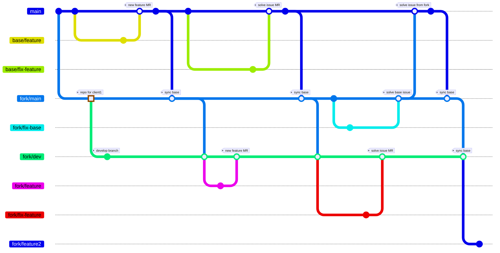
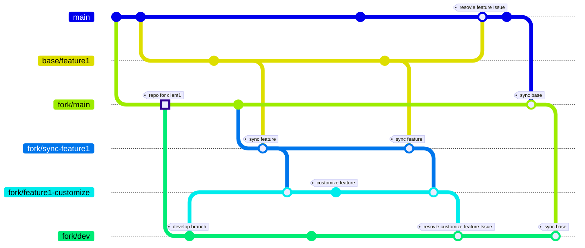

# Fork Workflow

- [view on github](https://github.com/tsengyushiang/notes/blob/master/git/workflow.md)

## Develop Git Graph

### Git Flow

### Merge Requests

|develop actions|branch's base|MR from|MR to|
|:---|:---:|:---:|:---:|
|base feature|`main`|`feature`|`main`|
|fix base feature|`main`|`fix`|`main`|
|customize feature|`fork/dev`|`fork/feature`|`fork/dev`|
|fix customize feature|`fork/dev`|`fork/fix`|`fork/dev`|
|fix base issue in frok|`fork/main`|`fork/fix-base`|`fork/main`|
|sync base|-|`main`|`fork/main`|
|update fix to base|-|`fork/main`|`main`|

## Develope on fork branch simultaneously

### Git Flow

### Merge Requests

|develop actions|branch's base|MR from|MR to|
|:---|:---:|:---:|:---:|
|base feature|`main`|`feature`|`main`|
|sync base feature to fork repo|-|`feature`|`fork/sync-feature`|
|sync base feature for customizing|-|`fork/sync-feature`|`fork/feature`|
|customize feature|`fork/dev`|`fork/feature`|`fork/dev`|
