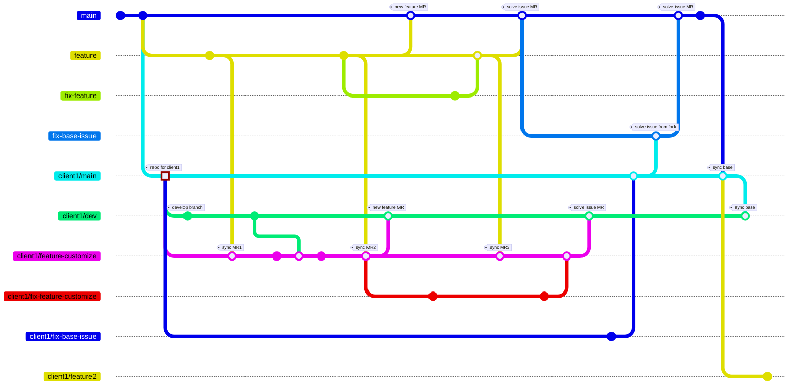
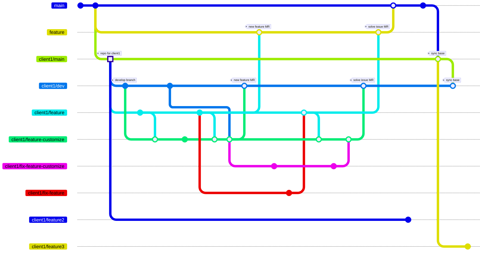

# Fork Workflow

- [view on github](https://github.com/tsengyushiang/notes/blob/master/git/workflow.md)

- develop on base repo, denote fork repo as `client1`.

- develop on fork repo, denote fork repo as `client1`.

