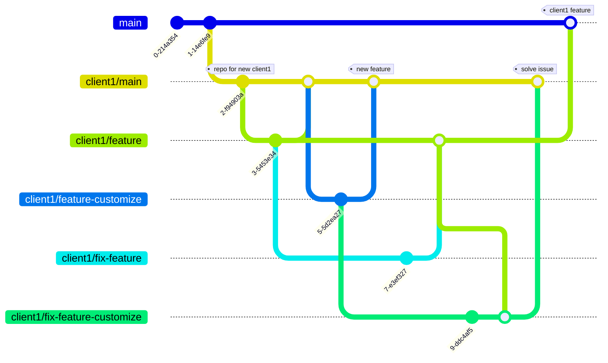

# Fork Workflow

- develope new feature one fork project 

```mermaid

gitGraph
    commit
    commit
    branch client1/main
    commit tag:"repo for new client1"
    branch client1/feature
    commit
    checkout client1/main
    merge client1/feature
    branch client1/feature-customize
    commit
    checkout client1/main
    merge client1/feature-customize tag:"new feature"
    checkout client1/feature
    branch client1/fix-feature
    commit
    checkout client1/feature
    merge client1/fix-feature
    checkout client1/feature-customize
    branch client1/fix-feature-customize
    commit
    merge client1/feature
    checkout client1/main
    merge client1/fix-feature-customize tag:"solve issue"
    checkout main
    merge client1/feature tag:"client1 feature"
```
