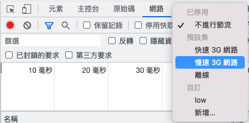
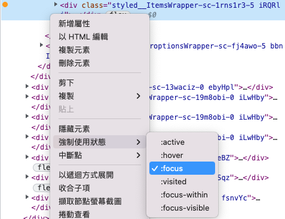

# Web Tools

## Chrome DevTools

- network throttling

- force css Pseudo classes

## Visualize

- [JSON](https://jsoncrack.com/editor)

## Documents

- [Online Flowchart Drawer](https://mermaid-js.github.io/docs/mermaid-live-editor-beta)

## Front-end

- [CSS HTML5 Support tables](https://caniuse.com/)
- [WebGL Report](https://webglreport.com/)

## Chrome plugins
    
- [Save Page WE](https://chrome.google.com/webstore/detail/save-page-we/dhhpefjklgkmgeafimnjhojgjamoafof) : download web-page to single html.
- [Save All Resources](https://chrome.google.com/webstore/detail/save-all-resources/abpdnfjocnmdomablahdcfnoggeeiedb) : download web-page resource including data from reqeuest