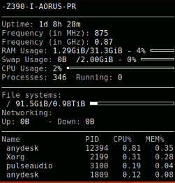
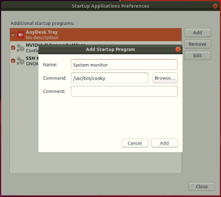

## Tools

- measure process real-time - [gnomon](https://www.npmjs.com/package/gnomon)

```
sudo apt-get install nodejs
sudo apt-get install nodejs-legacy

node -v
npm -v

sudo apt-get install npm
sudo npm i -g gnomon

// test command
ping -c 3 8.8.8.8 | gnomon

//result :
wt@wt-EMB-APL1:~/Desktop/opticalFLow/opencv/optical flow$ ping -c 3 8.8.8.8 | gnomon
   0.0125s   PING 8.8.8.8 (8.8.8.8) 56(84) bytes of data.
   0.6858s   64 bytes from 8.8.8.8: icmp_seq=1 ttl=52 time=3.19 ms
   1.0011s   64 bytes from 8.8.8.8: icmp_seq=2 ttl=52 time=2.59 ms
   0.0004s   64 bytes from 8.8.8.8: icmp_seq=3 ttl=52 time=3.21 ms
   0.0003s
   0.0002s   --- 8.8.8.8 ping statistics ---
   0.0004s   3 packets transmitted, 3 received, 0% packet loss, time 200
             2ms
   0.0056s   rtt min/avg/max/mdev = 2.595/3.001/3.211/0.290 ms
   0.0007s

     Total   1.7099s
```

- System Monitor 

  

  - install : `sudo apt install conky-all`
  - custom style to right :
    - `sudo sed -i 's/left/right/' /etc/conky/conky.conf`
    - `cp /etc/conky/conky.conf ~/.conkyrc`
  - set to startup app
  
    
  - [Tutorial](https://linuxconfig.org/system-monitoring-on-ubuntu-18-04-linux-with-conky)

